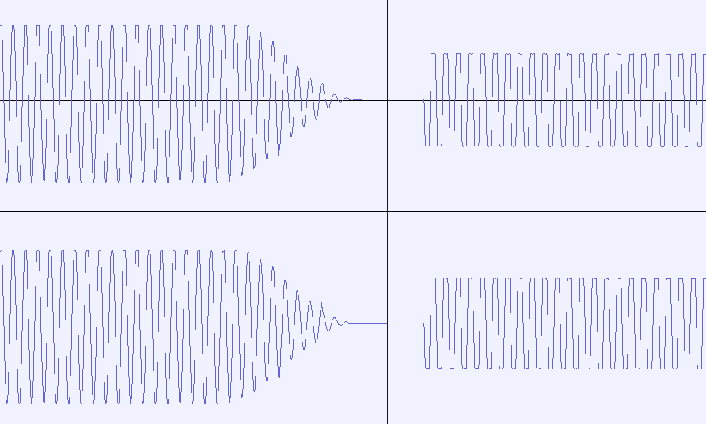

# FMA Audio Attenuation Test together with the CDIC

Plays a very short MPEG file in tandem with an ADPCM sample on repeat.
It is a 440 Hz sine wave in both cases.

Various possible attenuations are tested for analysis to compare the attenuation
of the CDIC against the DVC.

Here some pictures of example recordings from a 210/05 + VMPEG:

The clipping differences are rather interesting. The CDIC with the DAC and mixing circuit can get much louder than the VMPEG. In this example both left and right channel are driving a maximum volume sine wave and output on both channels, causing a maximum volume mono mixing.

