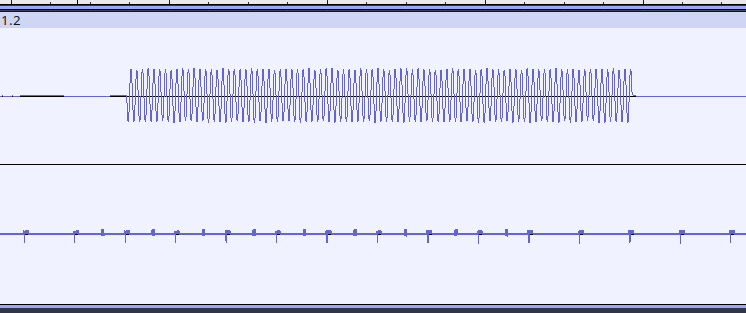

# FMV Audio & Video Sync

Plays a very short MPEG file and records register and driver states.
It contains a small white block for 5 frames and a sine wave at the same time.

This example can be used to check the synchronization between MPEG audio and MPEG video.
Use your soundcard and connect the CVBS signal and one of the audio channels.
The upper channel is the audio, the lower is the CVBS.
The vertical synchronization is visible, as well as the square that goes from the top to the bottom

After playback, the recording is printed over serial port and recorded into `log_vmpeg`.
For MiSTer and other emulators, perform a manual copy.
Python can be used to convert the recordings into a VCD file for viewing in GTKWave

    python -m venv venv
    venv/bin/python -m pip install cs2vcd
    venv/bin/python tovcd.py
    gtkwave wave.gtkw
