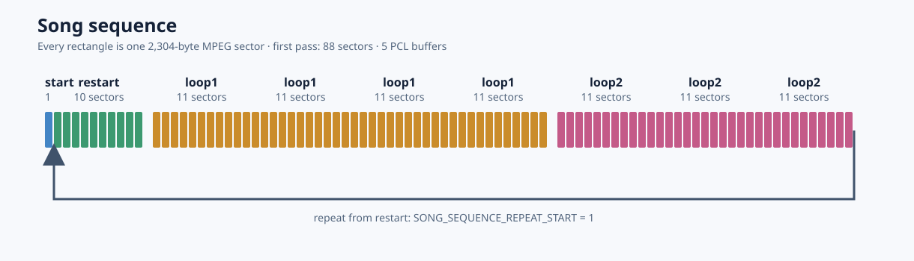

# Amiga Stardust Map Theme Seamless Playback Experiment

Fabricates a custom PCL chain in memory to play a song based on spliced MPEG data.

The whole song consists of 4 MPEG files.
There are (1+11+11+10) sectors in use.
With only 76032 byte for everything, this could be an interesting loading theme for a game that is not taking up much space.

This seems to be something rather advanced and experimental. Whether this was performed in a commercial title is unknown.

A lot here was written by ChatGPT to help me with the math of recalculating the timestamps of the sectors.

The song structure:

