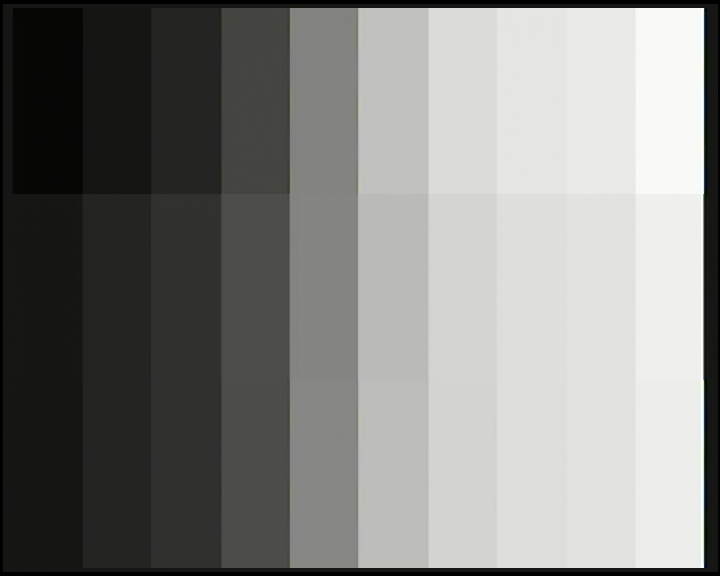

# FMV Colortest

Loads a MPEG stream with a frame of a color gradient into memory and shows it using the DVC.
The screen is split into three horizontal bands: the uncalibrated base case on
top, MPEG in the middle, and the calibrated base case at the bottom. This makes
both base cases visible against the same MPEG source to check for color accuracy.

## Preparing MPEG file

Run `python3 generate_reference_png.py` to create `reference.png`, then execute
`./create_movie_file.sh` to convert it to MPEG. The image contains ten
grayscale bars (0, 16, 32, 64, 128, 192, 223, 235, 239, and 255).
The uncalibrated base case uses those original values, while
the calibrated base case uses calibrated values (18, 32, 46, 75, 132, 188,
215, 226, 229, and 243) so its bars match the captured MPEG output. The
generator creates a 384x240 image, matching the existing MPEG input.

For my tuned USB grabber, the calibration from nominal MPEG source level `M`
to direct-DVC CLUT level `D` is approximately `D = 0.8838 * M + 18.0753`, rounded
to the nearest CLUT entry. The source test bars use the measured per-bar
values above, which are slightly more accurate than this linear fit. This is a
calibration for this CD-i and capture setting; repeat the measurement after
changing grabber brightness or contrast.

Execute `./create_movie_file.sh`, which converts the PNG into an MPEG file.
Feel free to replace the PNG file with another image.

## For the python capture using a video grabber

Run `python3 tune_capture.py`. Drag the brightness and contrast sliders (or
use the arrow keys) while observing the level bars. Press Space to save a
frame as `cap.png`; press q or Escape to quit.

For automatic setup, show the test pattern and run
`python3 auto_tune_capture.py`. It samples the full-height black and white
bars across the complete picture, then adjusts the grabber toward digital-video
levels 16 and 235. Use
`--target-black`, `--target-white`, `--min-value`, and `--max-value` to adapt
it to a different capture convention or device. It waits 30 frames after each
adjustment; increase `--settle-frames` if the grabber applies changes slowly.

The result is stored as `auto-cap.png`

Here an example:

