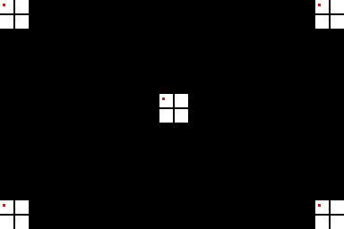

# FMV Offset Test

Loads a MPEG stream with a frame into memory and shows it using the DVC.
Draws some pixels in the base case video to show the alignment between both video outputs

The base image is this:

The resolution of 384x256 is the maximum possible vertical resolution due to the 396 macro block limitation of the CD-i.
This image is converted to an MPEG movie and the base case video is used to fill out
the 2x2 center pixels of the crosses.

## Preparing MPEG file

Execute `./create_movie_file.sh`, which converts the png into an MPEG file
