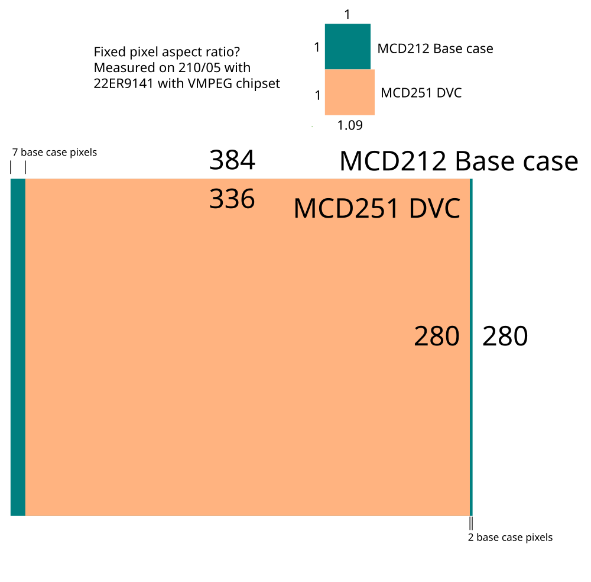

# FMV Offset Test (Forced VCD)

Loads a MPEG stream with a frame into memory and shows it using the DVC.
Draws some pixels in the base case video to show the alignment between both video outputs.

This time, there is a twist. The DVC hardware is forced into VCD pixel clock.
The vertical raster is unchanged by this but the horizontal one is stretched.

Note how the horizontal resolution is not capable of displaying the whole 352 pixel of a VCD.

Keep in mind that this software takes advantage of a design quirk of the VMPEG DVC. Green Book compatibility is not considered here.

## Preparing MPEG file

Execute `./create_movie_file.sh`, which converts the PNG into an MPEG file.
Feel free to replace the PNG file with another image.