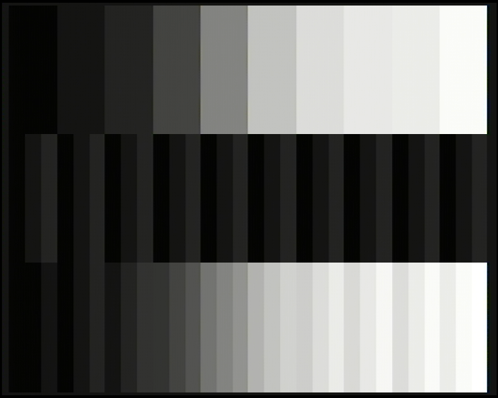

# LCT Mixing Test

This is a base case experiment to show the effect of mixing vs not mixing.
There is no MPEG functionality involved here.

Plane A fills the screen with ten raw grayscale bars
(0, 16, 32, 64, 128, 192, 223, 235, 239, and 255). Plane B is split into the
same ten bar-width regions, each containing three equal-width sub-bars at
literal CLUT levels 0, 16, and 32.

The LCT on Plane A changes the transparency/mixing instruction at each
one-third boundary:

1. Top: Plane A only, mixing disabled.
2. Middle: Plane B only, mixing disabled.
3. Bottom: Plane A and Plane B, mixing enabled.

This leaves both images unchanged in video memory; only the LCT controls which
planes contribute in each band.

Example taken via video grabber:

Use [fmv_colortest](../fmv_colortest/) to tune the USB video grabber to ensure all levels are visible.
